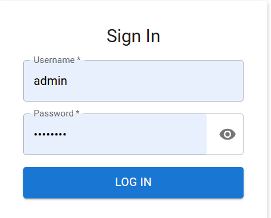
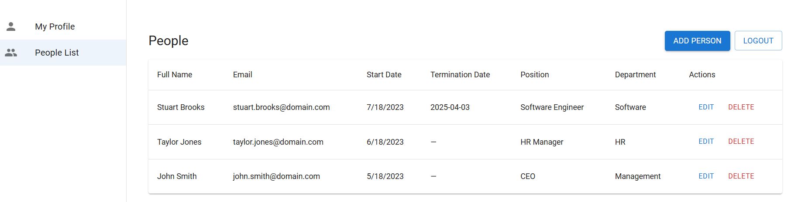
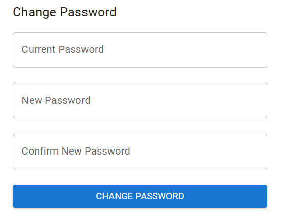
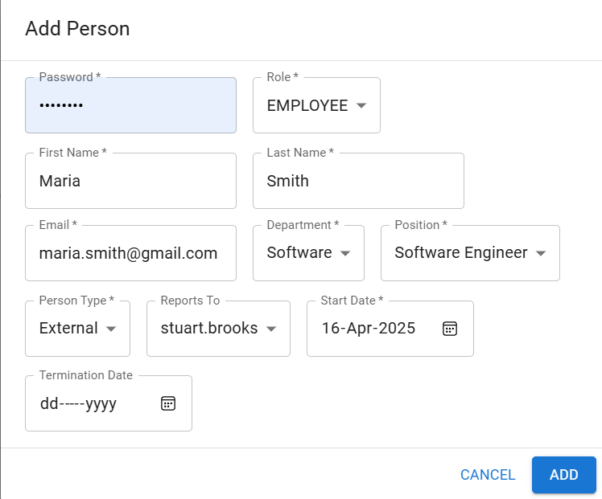
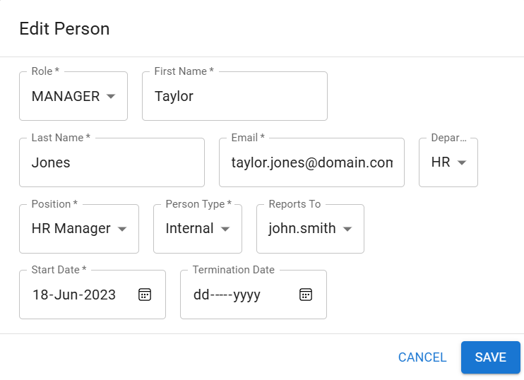

# HCM (Human Capital Management) App

> A .NET 8 Web API and React single‑page application for managing users, people, departments and positions with JWT‑based authentication (access & refresh tokens).

## Table of Contents

- [Features](#features)  
- [Tech Stack](#tech-stack)  
- [Architecture](#architecture)  
- [Screenshots](#screenshots)  

---

## Features

- **User Management**: Create, read, update, delete users & person profiles  
- **Departments & Positions**: Full CRUD for Departments and Positions  
- **JWT Authentication**:  
  - **Access Token** (short‑lived)  
  - **Refresh Token** (long‑lived)  
- **React SPA**:  
  - List/Add/Edit People  
  - User Profile & Change Password  
  - Secure routes based on JWT  

---

## Tech Stack

- **Backend**  
  - .NET 8 + C#  
  - ASP.NET Core Web API
  - Entity Framework Core (SQL Server)  
- **Frontend**  
  - React
  - React Router  
  - Axios for HTTP calls  

## Architecture

The HCM Web API is organized into four main layers to promote separation of concerns, testability, and reuse:

```text
[ ASP.NET Core Web API ]
        └── Controllers
              • AuthController
              • UsersController
              • PersonsController
              • DepartmentsController
              • PositionsController
                   ↓
[ Business Logic Library ]
        └── Services / Handlers
              • IUserService
              • IPersonService
              • IDepartmentService
              • IPositionService
                   ↓
[ Persistence Library ]
        └── Repositories (Repository Pattern)
              • IUserRepository
              • IPersonRepository
              • IDepartmentRepository
              • IPositionRepository
        └── EF Core DbContext
                   ↓
[ Core Library ]
        └── Common Models, Constants & Helpers
```


## Screenshots

**Login Page**  


**People List**  


**Change Password**  


**Add Person**  


**Edit Person**  

